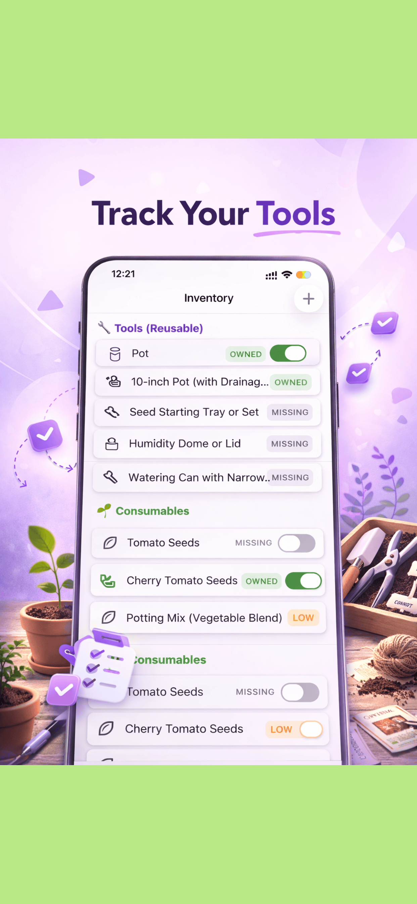
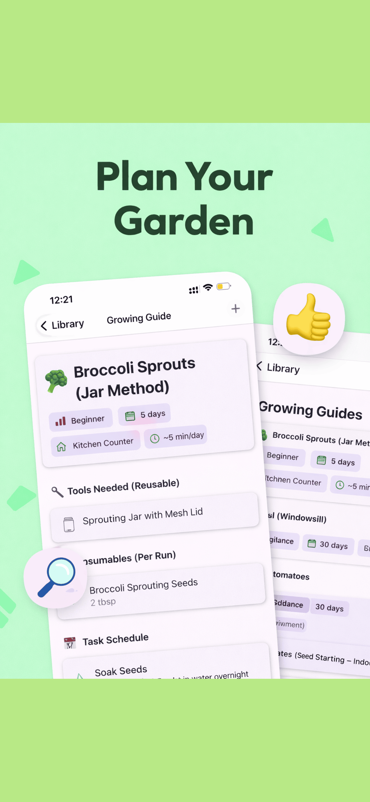
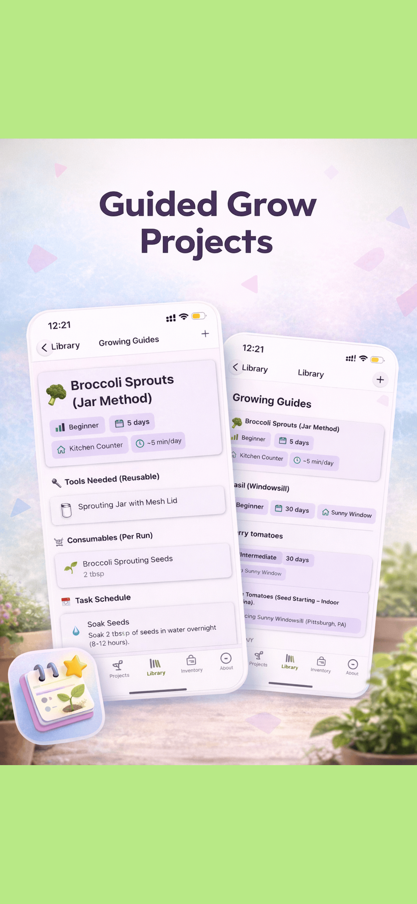

# 🌱 Open Garden

**Open Garden** is your all-in-one companion for managing gardens, tracking tools, and executing guided grow projects. Whether you are a hobbyist or a professional gardener, Open Garden helps you stay organized and ensure your plants thrive.

---

## 📸 Overview

| Track Your Tools | Plan Your Garden | Guided Grow Projects |
| :---: | :---: | :---: |
|  |  |  |

---

## ✨ Key Features

- **🛠️ Track Your Tools**: Keep a digital inventory of all your gardening equipment. Never lose track of where your tools are or when they need maintenance.
- **📅 Plan Your Garden**: Design your garden layout and schedule planting cycles with ease.
- **🌿 Guided Grow Projects**: Follow step-by-step guides for various plant species, from seedling to harvest.
- **🏗️ Staggered Setup**: Manage multiple planting runs with staggered starts to ensure a continuous harvest.
- **🌍 Multi-language Support**: Fully localized for a global community of gardeners.

---

## 🚀 Getting Started

### Prerequisites

- [Node.js](https://nodejs.org/) (LTS version recommended)
- [Expo CLI](https://docs.expo.dev/get-started/installation/)
- [Git](https://git-scm.com/)

### Installation

1. **Clone the repository:**
   ```bash
   git clone https://github.com/mikytinez/open-garden.git
   cd open-garden
   ```

2. **Install dependencies:**
   ```bash
   npm install
   ```

### Running the App

- **Start Expo Go:**
  ```bash
  npm start
  ```
- **Run on Android:**
  ```bash
  npm run android
  ```
- **Run on iOS:**
  ```bash
  npm run ios
  ```
- **Run on Web:**
  ```bash
  npm run web
  ```

---

## 🛠️ Technical Stack

- **Framework**: [React Native](https://reactnative.dev/) with [Expo](https://expo.dev/)
- **Language**: [TypeScript](https://www.typescriptlang.org/)
- **Database**: [SQLite](https://www.sqlite.org/) with [Drizzle ORM](https://orm.drizzle.team/)
- **State Management**: [Zustand](https://github.com/pmndrs/zustand)
- **UI Components**: [React Native Paper](https://reactnativepaper.com/)
- **Icons**: [Lucide React Native](https://lucide.dev/guide/packages/lucide-react-native)
- **Internationalization**: [i18next](https://www.i18next.com/)

---

## 🤝 How to Collaborate

We welcome contributions from the community! To get started:

1. **Fork** the repository.
2. **Create a new branch** for your feature or bugfix: `git checkout -b feature/your-feature-name`.
3. **Commit your changes**: `git commit -m 'Add some feature'`.
4. **Push to the branch**: `git push origin feature/your-feature-name`.
5. **Open a Pull Request**.

Please ensure your code follows the existing style and passes all linting/tests.

---

## 🆘 Support & Feedback

If you encounter any issues or have suggestions:

- **Issues**: Open a ticket on the [GitHub Issues](https://github.com/mikytinez/open-garden/issues) page.
- **Discussions**: Join our community discussions for help and feature requests.
- **Feedback**: Contact the maintainer [mikytinez](https://github.com/mikytinez).

---

## 📄 License

This project is licensed under the MIT License - see the [LICENSE](LICENSE) file for details.

---

*Happy Gardening!* 🌻
